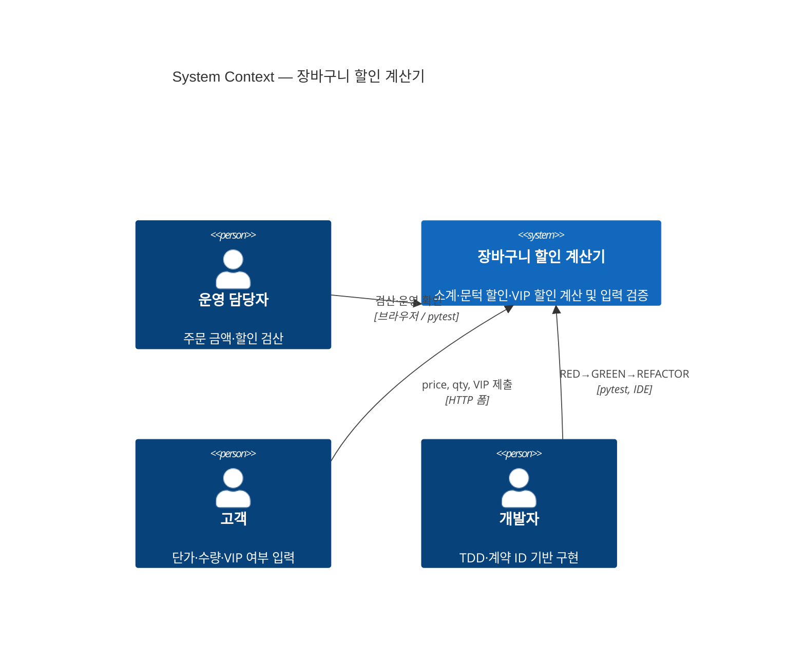
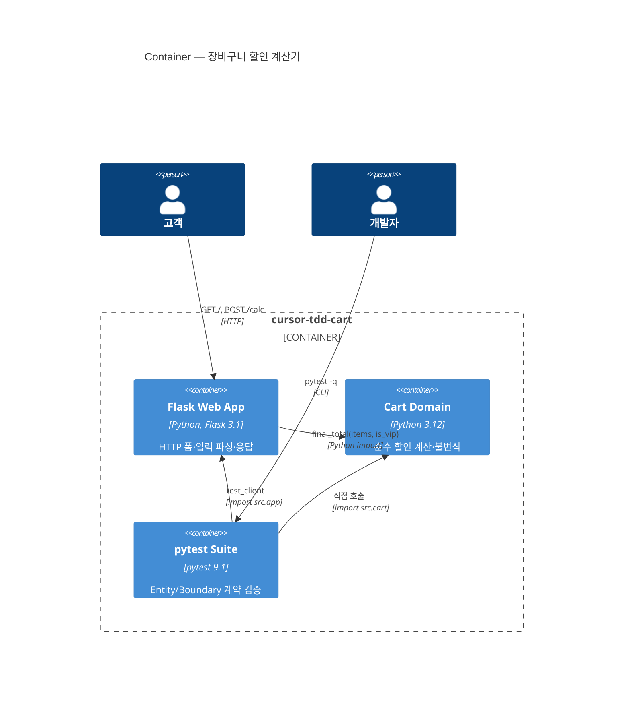
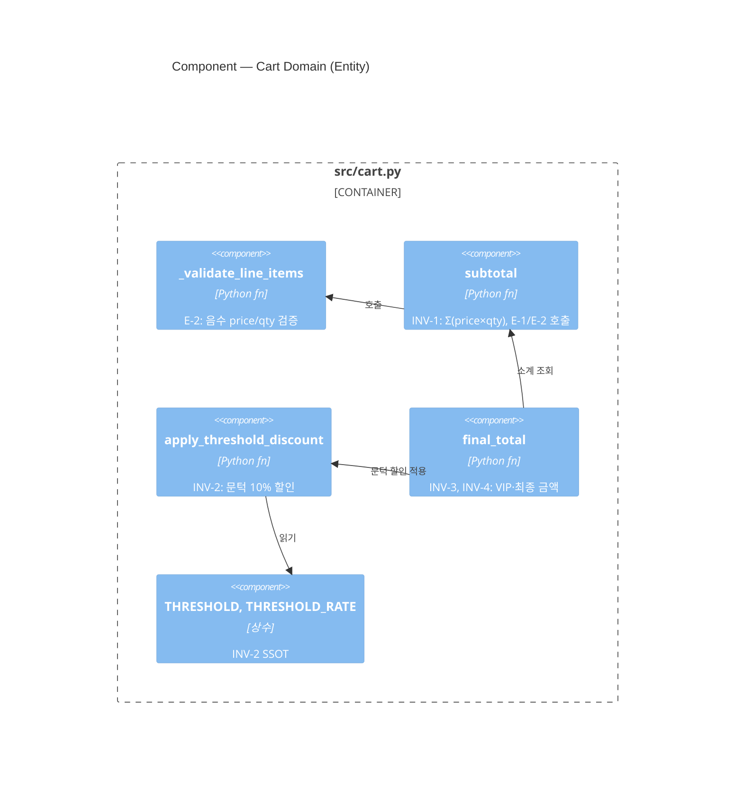
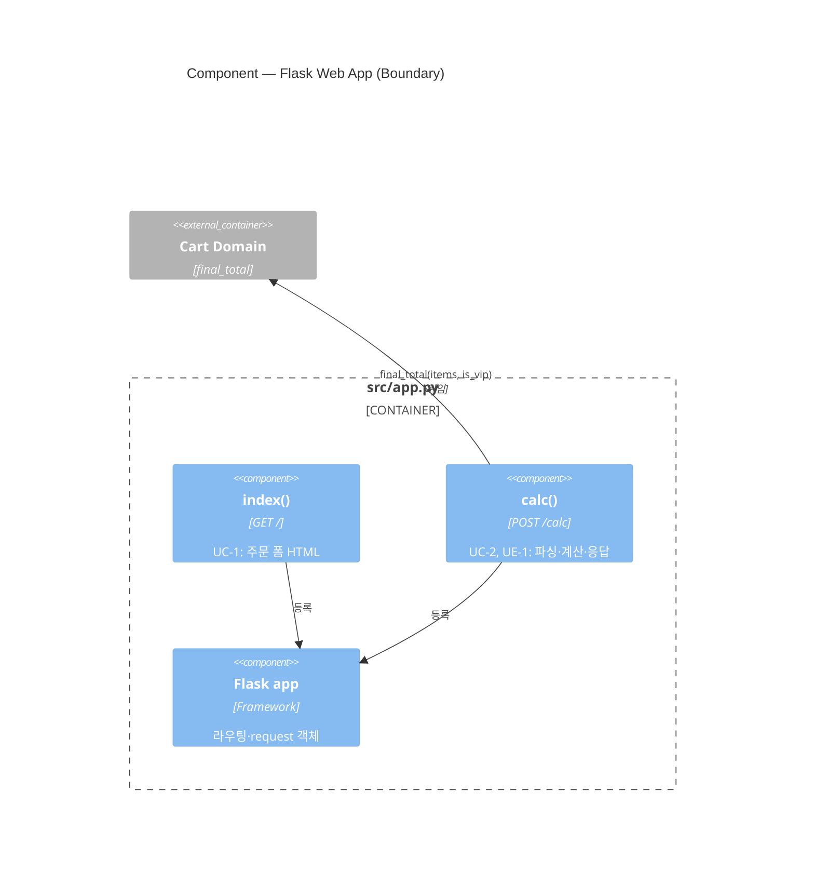
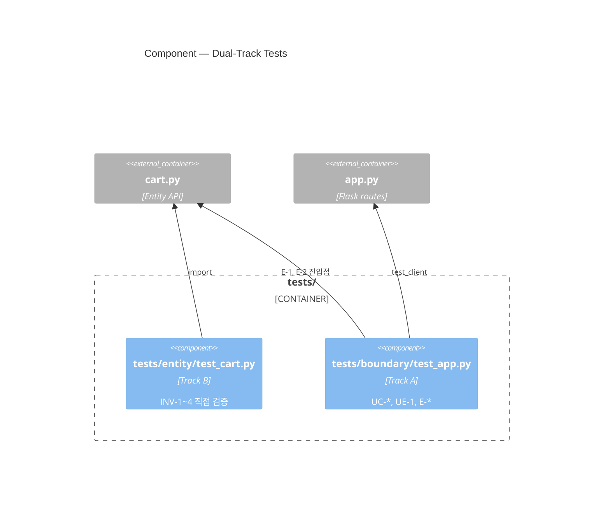
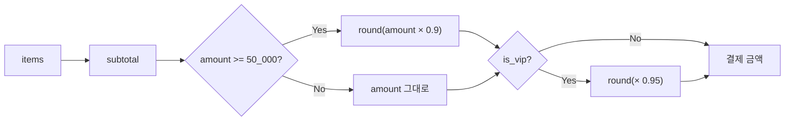
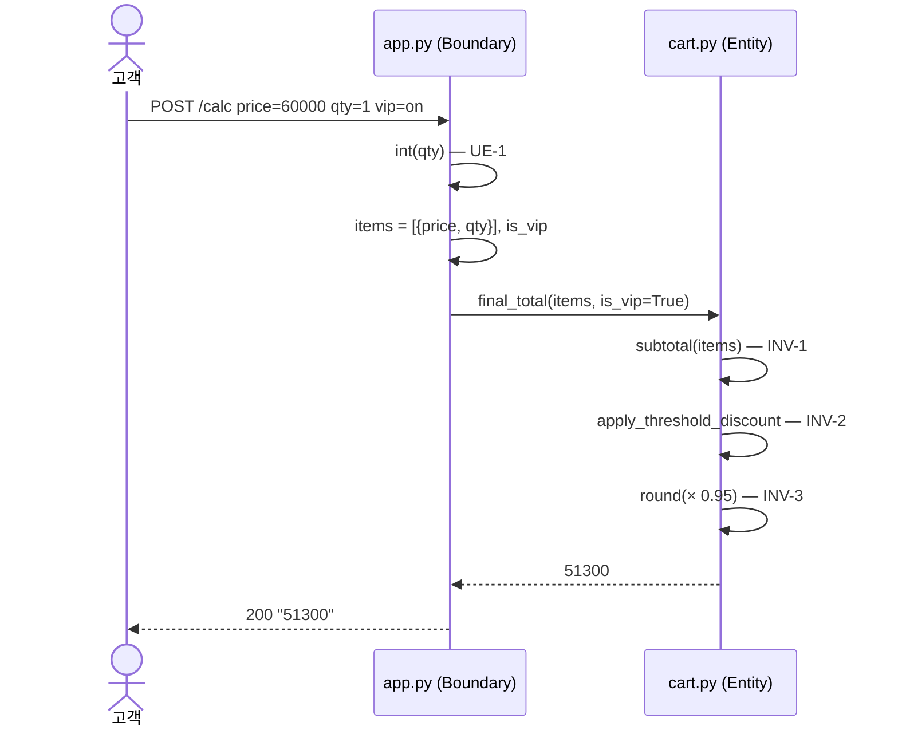

# C4 Architecture — 장바구니 할인 계산기

| 항목 | 내용 |
| ---- | ---- |
| 문서 ID | 04.c4-architecture |
| 프로젝트 | cursor-tdd-cart |
| 방법론 | [C4 Model](https://c4model.com/) + ECB (Entity–Control–Boundary) |
| 작성일 | 2026-06-24 |
| 대상 독자 | 신규 기여자, TDD 사이클 참여자 |

관련 문서: [01.product-discovery-contracts.md](./01.product-discovery-contracts.md) · [03.PRD.md](./03.PRD.md) · [AGENTS.md](../AGENTS.md)

---

## 0. 이 문서의 역할

코드베이스를 **4단계 줌**으로 설명한다.

| C4 Level | 질문 | 이 프로젝트에서 보면 |
| -------- | ---- | ------------------ |
| **1 Context** | 시스템이 누구와 무엇을 주고받나? | 운영자·고객 ↔ 할인 계산기 |
| **2 Container** | 실행 단위는 무엇인가? | Flask 앱, 도메인 모듈, pytest |
| **3 Component** | 컨테이너 안의 주요 부품은? | `subtotal`, `final_total`, 라우트 핸들러 |
| **4 Code** | 클래스·함수 수준은? | `cart.py` / `app.py` 공개 API |

> 이 저장소는 **ECB**를 C4 Container/Component에 매핑한다.  
> **Entity** = 도메인 컴포넌트 · **Boundary** = HTTP/UI 컴포넌트 · **Control** = 별도 모듈 없음(Flask 라우트가 얇은 조정 역할).

---

## 1. Level 1 — System Context

시스템 경계 밖의 액터와 시스템의 관계.

레이아웃: `UpdateLayoutConfig($c4ShapeInRow="3")` + 선언 순서(좌 Person → System → 우 Person → 아래 Person).



### 1.1 시스템 책임

- 장바구니 품목(`price`, `qty`)으로 **소계** 계산
- 소계 **≥ 50,000원**이면 10% 문턱 할인 (`round`)
- **VIP** 고객이면 문턱 할인 **후** 5% 추가 할인
- 잘못된 입력(음수, None, 비숫자 qty) **명시적 거부**

### 1.2 시스템 밖에 두는 것 (OOS)

쿠폰, 배송비, 세금, 포인트, DB, 결제 게이트웨이 — [Discovery §6](./01.product-discovery-contracts.md) 참조.

---

## 2. Level 2 — Container

시스템을 구성하는 **배포·실행 단위**.



### 2.1 Container 요약

| Container | 경로 | 기술 | 책임 |
| --------- | ---- | ---- | ---- |
| **Flask Web App** | `src/app.py` | Flask | Boundary — HTTP, 폼 파싱, UE-1 |
| **Cart Domain** | `src/cart.py` | 순수 Python | Entity — INV-*, E-1, E-2 |
| **pytest Suite** | `tests/` | pytest | Dual-Track 계약 검증 |

### 2.2 의존 방향 (필수)

```
tests/entity  ──►  src/cart.py
tests/boundary ──►  src/app.py  ──►  src/cart.py

src/cart.py  ✗──►  Flask / app.py   (금지)
```

Entity는 프레임워크를 모른다. Boundary만 Entity를 import 한다.

---

## 3. Level 3 — Component

### 3.1 Cart Domain (`src/cart.py`)



| Component | 계약 ID | 입력 → 출력 |
| --------- | ------- | ----------- |
| `_validate_line_items` | E-2 | `items` → void / `ValueError` |
| `subtotal` | INV-1, E-1, E-2 | `items: list[dict]` → `int` |
| `apply_threshold_discount` | INV-2 | `amount: int` → `int` |
| `final_total` | INV-3, INV-4 | `items, is_vip` → `int` |

### 3.2 Flask Web App (`src/app.py`)



| Component | 계약 ID | 동작 |
| --------- | ------- | ---- |
| `index()` | UC-1 | `price`, `qty`, `vip` 폼 반환 |
| `calc()` | UC-2, UE-1 | 폼 → `items` 변환 → `final_total` → 문자열 응답 |

### 3.3 Test Suite (`tests/`)



| Track | 경로 | 검증 대상 |
| ----- | ---- | --------- |
| **B (Entity)** | `tests/entity/` | 도메인 불변식 INV-* |
| **A (Boundary)** | `tests/boundary/` | HTTP 계약 UC-*, UE-1 + Entity 에러 E-* |

---

## 4. Level 4 — Code

### 4.1 공개 API (Entity)

```python
# src/cart.py — 프레임워크 무의존

THRESHOLD: int = 50_000      # INV-2
THRESHOLD_RATE: float = 0.9  # INV-2

def subtotal(items: list[dict]) -> int: ...
def apply_threshold_discount(amount: int) -> int: ...
def final_total(items: list[dict], is_vip: bool = False) -> int: ...
```

**품목 스키마** (암묵적 계약):

```python
item = {"price": int, "qty": int}
items = list[item]
```

### 4.2 Boundary 라우트

```python
# src/app.py

GET  /       → index()   # UC-1
POST /calc   → calc()    # UC-2, UE-1
```

**폼 필드 SSOT**: `price`, `qty`, `vip`(checkbox), `action=/calc`

### 4.3 할인 파이프라인 (핵심 흐름)



**예시** (UC-2 테스트 케이스):

```
price=60000, qty=1, vip=on
  → subtotal = 60000
  → threshold = round(60000 × 0.9) = 54000
  → vip       = round(54000 × 0.95) = 51300
```

### 4.4 에러 전파

| 위치 | 조건 | 결과 |
| ---- | ---- | ---- |
| Entity `subtotal` | `items is None` | `TypeError` (E-1) |
| Entity `_validate_line_items` | `price` or `qty` < 0 | `ValueError` + index (E-2) |
| Boundary `calc` | `qty` 비숫자 | HTTP 400 `"invalid qty"` (UE-1) |
| Boundary `calc` | Entity 예외 미처리 | 500 가능 *(음수 price 등 — 현재 미검증)* |

---

## 5. 계약 ID × C4 매핑

| 계약 ID | C4 Component | 테스트 |
| ------- | ------------ | ------ |
| INV-1 | `subtotal` | `test_inv_1_*` |
| INV-2 | `apply_threshold_discount` | `test_inv_2_*` |
| INV-3 | `final_total` (VIP 분기) | `test_inv_3_*` |
| INV-4 | `final_total` (전체) | `test_inv_4_*` |
| E-1 | `subtotal` | `test_e_1_*` (boundary) |
| E-2 | `_validate_line_items` | `test_e_2_*` (boundary) |
| UC-1 | `index()` | `test_uc_1_*` |
| UC-2 | `calc()` | `test_uc_2_*` |
| UE-1 | `calc()` qty 파싱 | `test_ue_1_*` |

계약 ID가 테스트·구현·이 문서를 잇는 **추적 키**다. ID 없는 동작은 구현하지 않는다.

---

## 6. 디렉터리 지도

```text
cursor-tdd-cart/
├── src/
│   ├── cart.py          # Entity  — INV-*, E-1, E-2
│   └── app.py           # Boundary — UC-*, UE-1
├── tests/
│   ├── entity/          # Track B — 도메인 불변식
│   └── boundary/        # Track A — HTTP + Entity 에러 진입
├── Report/              # Discovery, PRD, C4 (본 문서)
├── Prompting/           # MomTest·세션 Transcript
├── AGENTS.md            # 프로젝트 지도 (ECB, TDD 워크플로)
├── conftest.py          # src import 경로 설정
└── pytest.ini           # entity / boundary 마커
```

---

## 7. 런타임 시나리오 — POST /calc



---

## 8. 설계 결정 기록 (ADR 요약)

| 결정 | 이유 |
| ---- | ---- |
| ECB / Entity–Boundary 분리 | 할인 규칙을 HTTP와 독립 검증 (pytest entity track) |
| 계약 ID 주석 | C2C 추적 — RED/GREEN/REFACTOR 동일 ID 참조 |
| `round()` 사용 | 엑셀 검산 `(ROUND)` 근거 |
| 문턱 `>= 50_000` | README·테스트 경계값 50,000 → 45,000 |
| 단일 품목 폼 | UC-2 범위 — 다품목은 미계약 |
| E-1/E-2를 Entity에서 검증 | 실습 범위 — Boundary* 계약을 진입점에서 실행 |

---

## 9. 확장 시 C4 변경 가이드

| 추가 기능 | 영향 Container/Component | 선행 조건 |
| --------- | ------------------------ | --------- |
| 다품목 폼 | `calc()` 파싱 확장 | 신규 UC-* 계약 + Discovery |
| Discovery E-2 (빈 POST) | `calc()` 검증 강화 | RED 테스트 in boundary |
| 쿠폰 | `cart.py` 신규 component | OOS 해제 + AC/INV 정의 |

**규칙**: Component 추가 전 `Report/01.*` 또는 PRD에 계약 ID를 먼저 정의한다.

---

## 10. 빠른 탐색 체크리스트

신규 기여자가 코드를 읽을 때 권장 순서:

1. [AGENTS.md](../AGENTS.md) — ECB·TDD 워크플로
2. 본 문서 Level 2~3 — Container/Component 관계
3. `src/cart.py` — `final_total` 파이프라인
4. `tests/entity/test_cart.py` — INV 계약 예시
5. `src/app.py` + `tests/boundary/test_app.py` — HTTP 경계

```bash
pytest tests/entity -q    # 도메인만
pytest tests/boundary -q  # HTTP·경계만
pytest -q                 # 전체
```

---

*본 문서는 Report/04.c4-architecture.md — cursor-tdd-cart C4 아키텍처 문서입니다.*
