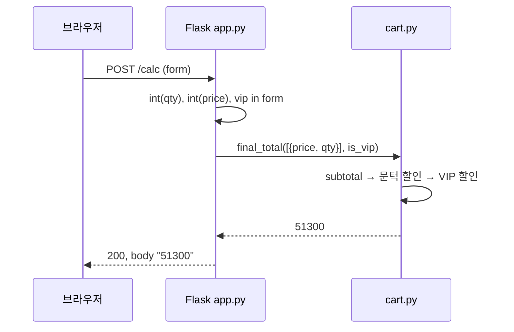

# Flask 개념 — 장바구니 할인 계산기 기준

| 항목 | 내용 |
| ---- | ---- |
| 문서 ID | 05.flask-concepts |
| 프로젝트 | cursor-tdd-cart |
| Flask 버전 | 3.1.3 (`requirements.txt`) |
| 대상 독자 | Flask 입문자, Boundary(Track A) 작업자 |
| 작성일 | 2026-06-25 |

관련 문서: [04.c4-architecture.md](./04.c4-architecture.md) · [AGENTS.md](../AGENTS.md) · [README.md](../README.md)

---

## 0. 이 문서의 역할

Flask **핵심 개념**을 설명하고, 각 개념이 이 프로젝트의 **`src/app.py`** 에 어떻게 매핑되는지 보여 준다.

이 저장소의 Flask는 **최소 Boundary**다. 템플릿 엔진·블루프린트·DB·세션 등은 의도적으로 쓰지 않는다. 할인 로직은 Entity(`src/cart.py`)에만 둔다.

---

## 1. Flask란?

**Flask**는 Python **마이크로 웹 프레임워크**다. URL 경로에 함수를 연결(라우팅)하고, HTTP 요청을 받아 응답을 돌려준다.

| 용어 | 한 줄 설명 | 이 프로젝트 |
| ---- | ---------- | ----------- |
| **WSGI** | Python 웹 앱과 서버 사이의 표준 인터페이스 | `app` 객체가 WSGI 애플리케이션 |
| **Application** | 요청을 받는 Flask 앱 인스턴스 | `app = Flask(__name__)` |
| **Route** | URL + HTTP 메서드 → 뷰 함수 | `GET /`, `POST /calc` |
| **View function** | 요청을 처리해 응답을 만드는 함수 | `index()`, `calc()` |
| **Request** | 클라이언트가 보낸 HTTP 요청 객체 | `request.form` (폼 데이터) |
| **Response** | 상태 코드 + 본문 | `(html, 200)`, `("invalid qty", 400)` |

의존 관계:

```
브라우저 / pytest test_client
        │  HTTP
        ▼
   src/app.py  (Boundary — Flask)
        │  Python import
        ▼
   src/cart.py (Entity — 순수 로직)
```

**Entity는 Flask를 import하지 않는다.** Boundary만 Entity를 호출한다. ([C4 Container §2.2](./04.c4-architecture.md))

---

## 2. Application 객체

```python
from flask import Flask

app = Flask(__name__)
```

- `Flask(__name__)` : 현재 모듈 이름으로 앱을 만든다. 설정·템플릿 경로 등에 쓰인다.
- `app` : 이 모듈의 **진입점**. 개발 서버나 WSGI 서버(gunicorn 등)가 이 객체를 실행한다.

**이 프로젝트:** `src/app.py` 20행. 앱 인스턴스 하나, 라우트 두 개만 등록한다.

### 로컬 실행

```bash
# 프로젝트 루트에서
pip install -r requirements.txt
flask --app src.app run
```

브라우저에서 `http://127.0.0.1:5000/` → 주문 폼(UC-1).

---

## 3. 라우팅 (Route / View)

라우트는 **URL + HTTP 메서드**와 **뷰 함수**를 연결한다.

### 3.1 데코레이터 방식 (이 프로젝트)

```python
@app.get("/")
def index():
    ...

@app.post("/calc")
def calc():
    ...
```

| 개념 | Flask | 이 프로젝트 계약 |
| ---- | ----- | ---------------- |
| `GET /` | `index()` | **UC-1** — 200, `price`·`qty`·`vip` 폼 |
| `POST /calc` | `calc()` | **UC-2** — 계산 결과 표시 · **UE-1** — 잘못된 qty → 400 |

Flask 2.x+ 에서 `@app.get`, `@app.post` 를 쓸 수 있다. `@app.route("/", methods=["GET"])` 와 동일하다.

### 3.2 뷰 함수의 반환값

Flask는 뷰 함수 반환값을 HTTP 응답으로 변환한다.

| 반환 형태 | 의미 | 프로젝트 예 |
| --------- | ---- | ----------- |
| `문자열` | 본문, 기본 200 | `return str(total)` (UC-2) |
| `(본문, 상태코드)` | 본문 + 명시적 상태 | `return "invalid qty", 400` (UE-1) |
| `(본문, 상태코드, 헤더)` | 헤더 추가 | 미사용 |

```23:31:src/app.py
@app.get("/")
def index():
    return (
        '<form method="post" action="/calc">'
        '<input name="price" type="text">'
        '<input name="qty" type="text">'
        '<input name="vip" type="checkbox">'
        '<button type="submit">Calc</button>'
        '</form>'
    ), 200  # UC-1
```

템플릿(Jinja2) 대신 **문자열 HTML**을 직접 반환한다. Boundary를 얇게 유지하기 위한 선택이다.

---

## 4. Request — 폼 입력 읽기

```python
from flask import request

qty = request.form.get("qty", "")
price = int(request.form.get("price", "0"))
is_vip = "vip" in request.form
```

| API | 역할 | 프로젝트 |
| --- | ---- | -------- |
| `request.form` | `application/x-www-form-urlencoded` 또는 `multipart/form-data` POST 필드 | `/calc` 폼 제출 |
| `request.form.get(key, default)` | 필드 값 또는 기본값 | `qty`, `price` |
| `"vip" in request.form` | 체크박스: 체크 시에만 키 존재 | VIP 여부 |

**폼 필드 SSOT** (`app.py` docstring): `price`, `qty`, `vip`(checkbox), `action=/calc`.

### Boundary vs Entity 검증

| 계층 | 검증 | 계약 | 예 |
| ---- | ---- | ---- | -- |
| **Boundary** | HTTP 형식·파싱 | UE-1 | `qty="abc"` → 400 |
| **Entity** | 도메인 규칙 | E-1, E-2 | `items is None`, 음수 price/qty |

Boundary는 **숫자로 파싱 가능한지**만 본다. 음수·None 같은 도메인 오류는 Entity(`final_total` → `subtotal`)에 맡긴다. (Discovery E-2 — 빈 POST 시 500 방지는 **미구현**, 다음 사이클 예정)

```35:45:src/app.py
@app.post("/calc")
def calc():
    try:
        qty = int(request.form.get("qty", ""))  # UE-1
    except ValueError:
        return "invalid qty", 400  # UE-1
    price = int(request.form.get("price", "0"))  # UC-2
    is_vip = "vip" in request.form  # UC-2
    items = [{"price": price, "qty": qty}]
    total = final_total(items, is_vip=is_vip)  # UC-2
    return str(total), 200  # UC-2
```

**핵심:** `calc()`는 할인 공식을 재구현하지 않고 `final_total`에 **위임**한다 (UC-2).

---

## 5. ECB에서 Boundary 역할

| ECB | 파일 | Flask 관련 책임 |
| --- | ---- | --------------- |
| **Entity** | `src/cart.py` | 없음 (Flask import 금지) |
| **Boundary** | `src/app.py` | 라우트, 폼 파싱, HTTP 상태·본문 |
| **Control** | (별도 모듈 없음) | Flask 라우트가 얇은 조정자 |

Boundary가 하는 일:

1. HTTP 요청을 **도메인 입력**(`items`, `is_vip`)으로 변환
2. Entity API 호출
3. 결과를 **HTTP 응답**으로 변환

Boundary가 하지 **않는** 일:

- `THRESHOLD`, `0.9`, `0.95` 등 할인 규칙 중복
- `subtotal` / `apply_threshold_discount` 직접 호출 (현재는 `final_total`만 사용)

---

## 6. pytest로 Boundary 테스트

Flask는 **`test_client`** 로 HTTP를 실제 포트 없이 검증한다.

```python
@pytest.fixture
def client():
    app.config["TESTING"] = True
    with app.test_client() as test_client:
        yield test_client

def test_uc_1_get_root_returns_200_with_qty_input(client):
    response = client.get("/")
    assert response.status_code == 200
    assert 'name="qty"' in response.get_data(as_text=True)
```

| 개념 | 설명 |
| ---- | ---- |
| `app.config["TESTING"] = True` | 테스트 모드 (예외 처리·보안 쿠키 등) |
| `test_client()` | WSGI 앱을 메모리에서 호출하는 가짜 클라이언트 |
| `client.get("/")` | GET 요청 |
| `client.post("/calc", data={...})` | POST + 폼 필드 |
| `response.status_code` | HTTP 상태 코드 |
| `response.get_data(as_text=True)` | 응답 본문 문자열 |

테스트 파일: `tests/boundary/test_app.py` (Track A).

```bash
pytest tests/boundary -q    # Boundary만
pytest -q                   # 전체 18 tests
```

---

## 7. 요청 흐름 (POST /calc)

고객이 `price=60000`, `qty=1`, VIP 체크 후 제출할 때:



계산 근거 (Entity, INV-3):

- 소계 `60000` → 문턱 할인 `round(60000 × 0.9) = 54000`
- VIP `round(54000 × 0.95) = 51300`

Boundary 테스트 `test_uc_2_post_calc_displays_final_total`가 이 값을 본문에 포함하는지 검증한다.

---

## 8. 이 프로젝트에 없는 Flask 기능 (의도적)

과잉 구현을 피하기 위해 **사용하지 않는** Flask 영역:

| 기능 | 일반적 용도 | 이 프로젝트 |
| ---- | ----------- | ----------- |
| `render_template` | Jinja2 HTML | 문자열 HTML만 (UC-1) |
| Blueprint | 대규모 앱 라우트 분리 | 라우트 2개 — 불필요 |
| `session` / `flash` | 로그인·메시지 | 없음 |
| `jsonify` / REST API | JSON API | 폼 + plain text 응답 |
| `before_request` / middleware | 공통 전처리 | 없음 |
| ORM / DB | 영속화 | 없음 |

새 계약 ID 없이 위 기능을 추가하지 않는다 ([README §구현 금지](../README.md)).

---

## 9. 개념 ↔ 코드 빠른 참조

| Flask 개념 | 위치 | 계약 ID |
| ---------- | ---- | ------- |
| `Flask(__name__)` | `app.py:20` | — |
| `@app.get("/")` | `app.py:23-31` | UC-1 |
| `@app.post("/calc")` | `app.py:35-45` | UC-2, UE-1 |
| `request.form` | `app.py:38-42` | UC-2, UE-1 |
| `final_total(...)` 위임 | `app.py:44` | UC-2 |
| `test_client` | `tests/boundary/test_app.py` | UC-*, UE-1 |

---

## 10. 다음 학습·작업 포인트

1. **Discovery E-2** — `items` 없이 POST 시 HTTP 500 방지 (Boundary 계약, 미착수)
2. [Flask 공식 튜토리얼](https://flask.palletsprojects.com/en/3.1.x/quickstart/) — Quickstart의 Routing, Request Object 섹션
3. [04.c4-architecture.md §3.2](./04.c4-architecture.md) — Flask Web App 컴포넌트 다이어그램

---

## 부록 A. Flask 앱 vs Entity 단위 테스트

| | Boundary (`test_app.py`) | Entity (`test_cart.py`) |
| - | ------------------------ | ----------------------- |
| **호출 방식** | HTTP (`client.get/post`) | Python (`subtotal`, `final_total`) |
| **검증 대상** | 상태 코드, HTML/본문 | 반환값, 예외 |
| **Flask 필요** | 예 | 아니오 |
| **계약 예** | UC-1, UC-2, UE-1 | INV-1~4, E-1, E-2 |

Dual-Track TDD: Entity(Track B)를 먼저 GREEN으로 만든 뒤, Boundary(Track A)가 HTTP로 그 결과를 노출한다.
